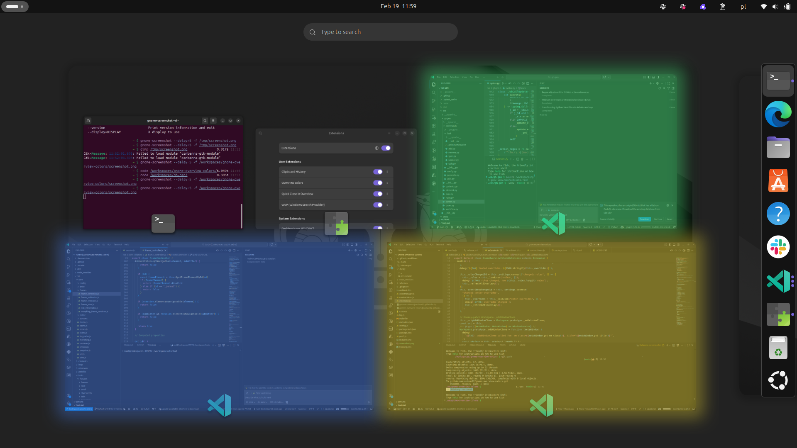

# Overview colors

A GNOME Shell extension that adds colored shades to window thumbnails in the
overview, helping you quickly identify windows at a glance.

Supports **GNOME Shell 45–48**.



## Features

- **Rule-based matching** — define regex rules on `WM_CLASS` and window title to
  select which windows get colored
- **Deterministic colors** — colors are assigned by hashing a stable identity
  extracted from the window (e.g. the VS Code workspace name), so the same
  window always gets the same color across sessions
- **Manual overrides** — right-click a matched window in the overview to pick a
  color from a 10-color palette; overrides are saved in GSettings
- **Create rules from the overview** — right-click an _unmatched_ window to
  create a matching rule on the spot, with pre-filled `WM_CLASS` and title
- **Hover emphasis** — the overlay tint and aura dynamically intensify when
  hovering over a window preview

## Installation

Install from GitHub Releases:

```sh
# Download the latest release package
curl -fL -o gnome-overview-colors.zip \
  https://github.com/redsun82/gnome-overview-colors/releases/latest/download/gnome-overview-colors@redsun82.github.io.zip

# Install (use --force to replace an existing install)
gnome-extensions install --force gnome-overview-colors.zip
```

Then enable the extension:

```sh
gnome-extensions enable gnome-overview-colors@redsun82.github.io
```

For development, use `make dev-install` instead — this symlinks the source
directory into `~/.local/share/gnome-shell/extensions/` so changes take effect
on the next GNOME Shell restart (`Alt+F2` → `r` on X11, or log out/in on
Wayland).

### Other Makefile targets

| Target        | Description                                                                        |
| ------------- | ---------------------------------------------------------------------------------- |
| `dev-install` | Compile schema + symlink source dir for development                                |
| `uninstall`   | Remove the extension                                                               |
| `pack`        | Build a distributable `.zip`                                                       |
| `schema`      | Compile the GSettings schema (run automatically by `install`/`dev-install`/`pack`) |
| `clean`       | Remove the built `.zip`                                                            |

## Configuration

Open the extension preferences:

```sh
gnome-extensions prefs gnome-overview-colors@redsun82.github.io
```

The preferences UI has three pages:

### Rules

A list of window-matching rules. Each rule has:

- **WM_CLASS pattern** — regex matched against `WM_CLASS` (e.g. `^code$` for
  VS Code)
- **Title pattern** — regex applied to the window title; the first **capture
  group** (or the full match) becomes the identity used for color hashing (e.g.
  `— (.+?) —` captures the workspace name from a VS Code title like
  `file.ts — MyProject — Visual Studio Code`). If left empty, the `WM_CLASS`
  itself is used as the identity, giving all windows of that class the same
  color.

Invalid regexes are highlighted in the UI.

### Overrides

Lists all manual color overrides set via the overview context menu. Each entry
can be cleared individually, or all overrides can be cleared at once.

### General

- **Debug Logs** — toggle detailed logging to the journal

## License

GPL-3.0
